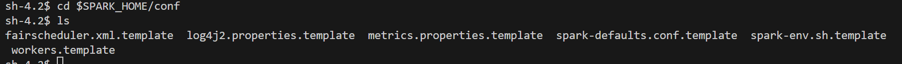

# Lesson 7: Spark

## 啟動 docker compose

```bash
docker-compose up -d
```

## 進入容器

建議開啟三個 Terminal 分別進入三個容器

```bash
docker exec -it lesson7_namenode_1 bash
```

```bash
docker exec -it lesson7_datanode_a_1 bash
```

```bash
docker exec -it lesson7_datanode_b_1 bash
```

## 安裝 wget 與 vim

```bash
sudo yum install wget vim openssh openssh-clients openssh-server -y
```

## 下載 Spark

在每個容器中下載 Spark

```bash
wget https://dlcdn.apache.org/spark/spark-3.5.1/spark-3.5.1-bin-hadoop3.tgz --no-check-certificate
```

## 解壓縮

```bash
sudo tar -zxf ./spark-3.5.1-bin-hadoop3.tgz
```

## 移動位置

```bash
sudo mv spark-3.5.1-bin-hadoop3 /usr/local/spark/
```

## 更改權限

使用者名稱會因為不同的環境而有所不同，這裡以 hadoop 為例

```bash
sudo chown hadoop:hadoop -R /usr/local/spark/
```

## 設定環境變數

```bash
sudo vim ~/.bashrc
```

在檔案最後加入以下內容

```bash
export SPARK_HOME=/usr/local/spark
export PATH=$PATH:$SPARK_HOME/bin
```

或是使用 touch 與 echo

```bash
sudo touch ~/.bashrc # 如果沒有這個檔案的話
sudo chown hadoop:hadoop ~/.bashrc
echo "export SPARK_HOME=/usr/local/spark" >> ~/.bashrc
echo "export PATH=$PATH:$SPARK_HOME/bin" >> ~/.bashrc
```

檢查是否有設定成功

```bash
cat ~/.bashrc
```

## 重新載入

```bash
source ~/.bashrc
```

檢查是否有設定成功

```bash
echo $SPARK_HOME
```

目前為止 以上步驟在三個容器中都要執行

## Master 設定 spark worker

在 namenode 容器中

```bash
cd $SPARK_HOME/conf
ls
```

你可以看到如下檔案



設定workers.template

```bash
cp workers.template workers
# 或是把 cp 換成 mv 也可以
```

使用 vim 編輯 workers

```bash
vim workers
```

改成以下內容

```bash
lesson7_datanode_a_1
lesson7_datanode_b_1
```