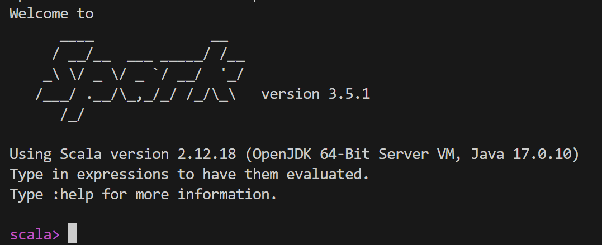

<!--
 * @Author: hibana2077 hibana2077@gmail.com
 * @Date: 2024-04-09 09:32:25
 * @LastEditors: hibana2077 hibana2077@gmail.com
 * @LastEditTime: 2024-04-09 14:06:56
 * @FilePath: \nttu_big_data_class_2024\lesson7\note.md
 * @Description: 这是默认设置,请设置`customMade`, 打开koroFileHeader查看配置 进行设置: https://github.com/OBKoro1/koro1FileHeader/wiki/%E9%85%8D%E7%BD%AE
-->
# Lesson 7: Spark

## 啟動 docker compose

```bash
docker-compose up -d
```

## 成功後，進入 spark-master 容器

```bash
docker exec -it lesson7_spark_1 bash
```

## 啟動 spark-shell

```bash
spark-shell
```



## 撰寫 Spark 程式

```scala
val data = Array(1, 2, 3, 4, 5)
val distData = sc.parallelize(data)
distData.reduce((a, b) => a + b)
```

## Scala 隨便介紹

## println

就 println

```scala
println("Hello, World!")
```

## clear screen

```scala
print("\u001b[2J")
```

### List

List 長度不可變，元素可變

```scala
val list = List(1, 2, 3, 4, 5)
```

### ListBuffer

ListBuffer 長度可變，元素可變

```scala
val listBuffer = ListBuffer(1, 2, 3, 4, 5)
```

- append : +=
- expend : ++=
- remove : -=